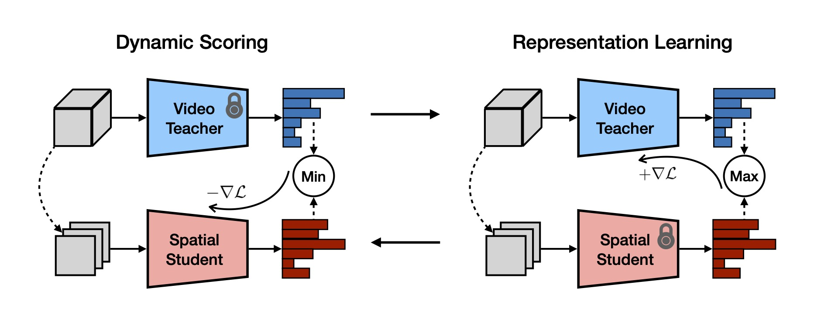

# Improving Video Model Transfer with Dynamic Representation Learning (CVPR 2022)

[Yi Li](http://www.svcl.ucsd.edu/people/yili), [Nuno Vasconcelos](http://www.svcl.ucsd.edu/~nuno)

**[Project page](http://svcl.ucsd.edu/projects/drl) | [Paper](http://svcl.ucsd.edu/people/yili/publications/drl/main.pdf)**

This repository contains PyTorch implementation of **dynamic representation learning (DRL)**, a framework for evaluating and improving the temporality of video representations.

<p align="center">
  
</p>

## Get started

The code is tested with Python 3.7+ and PyTorch 1.5.0+. To install required packages:

```bash
pip install torch torchvision torchaudio pyyaml tensorboard av opencv-python scikit-image pandas
```

## Usage

Paths to video datasets should be updated to `datasets/_paths.py`. All examples below use 3D ResNet-18 as the backbone; additional configs are provided in `configs/`.

### Baseline pre-training

```bash
python main.py configs/k400/res3d18.yaml
```

### Dynamic representation learning

DRL by adversarial augmentation (FGSM, eps=0.03)
```bash
python main-drl.py configs/k400/res3d18.yaml configs/drl/fgsm-e3-i5.yaml
```

DRL by direct optimization (freeze, lambda=0.5)
```bash
python main-drl-dir.py configs/k400/res3d18.yaml configs/drl/kd0.5-freeze.yaml
```

### Evaluation

Dynamic scoring on Kinetics (2D ResNet-18 as spatial model)
```bash
python main-drl.py configs/k400/res3d18.yaml configs/scoring/res2d18.yaml --pretrain <path-to-pretrained-model>
```

Fine-tuning on HMDB
```bash
python main.py configs/hmdb/res3d18.yaml --pretrain <path-to-pretrained-model>
```

Few-shot learning on Something-Something v2 (K=1)
```bash
python main-fsl.py configs/sthv2-fs/res3d18-1shot.yaml --pretrain <path-to-pretrained-model>
```

## Acknowledgements

This work was funded in part by NSF awards IIS-1924937, IIS-2041009, a gift from Amazon, and a gift from Qualcomm.
We acknowledge the use of Nautilus platform for some of the experiments in the paper.

Part of the code is adapted from the following repos:
- https://github.com/kenshohara/3D-ResNets-PyTorch
- https://github.com/mit-han-lab/temporal-shift-module
- https://github.com/wanglouis49/pytorch-adversarial_box
- https://github.com/hassony2/torch_videovision
- https://github.com/yinboc/few-shot-meta-baseline

## Citation

If you find this repo useful, please cite our work. Thanks!
```
@inproceedings{li2022improving,
  title={Improving Video Model Transfer with Dynamic Representation Learning},
  author={Li, Yi and Vasconcelos, Nuno},
  booktitle={Proceedings of the IEEE/CVF Conference on Computer Vision and Pattern Recognition},
  pages={19280--19291},
  year={2022}
}
```
